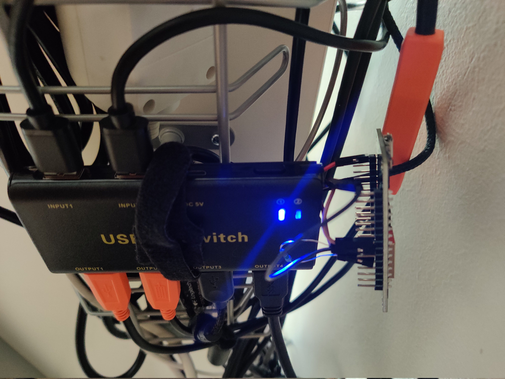

# USB-Switch commander

Command USB switch (f.ex. https://www.amazon.de/gp/product/B07WMG6LB7) using an ESP8266 NodeMCU.
Switching is achieved by pulling down one of the pins on NodeMCU to simulate pressing the button on the hub.
Additionally the state of the hub can be monitored by tapping to one of the status LEDs.

## Setup

1. Find 5V and ground on the USB switch and wire them to VIN and GND pin on nodeMCU
2. Figure out logic of the button, we are assuming it's pull down when pressed
3. Wire the button's monitored pin to D6. You may need to add a high value resistor to ground in order to keep voltage below 3,6V for NodeMCU
4. Optionally to monitor switch selection wire one of the selection LEDs to D5 (Make sure the LED is receiving under 3,6V so you don't kill the nodeMCU)
5. Copy `include/config.h.example` as `include/config.h`
6. Set your configuration in `config.h`

## MQTT

- `ledstate` is 0 or 1 depending whether connected LED is lit
- `command` is the state of output pin, by default 1 for voltage applied. If set to 0 pin will be pulled down for 100ms and then returned to high. NodeMCU will also reset the topic back to 1

## Over The Air update

Documentation: https://arduino-esp8266.readthedocs.io/en/latest/ota_updates/readme.html#web-browser

Basic steps:

- Use PlatformIO: Build
- Browse to http://IP_ADDRESS/update or http://hostname.local/update
- Select .pio/build/nodemcuv2/firmware.bin from work directory as Firmware and press Update Firmware
